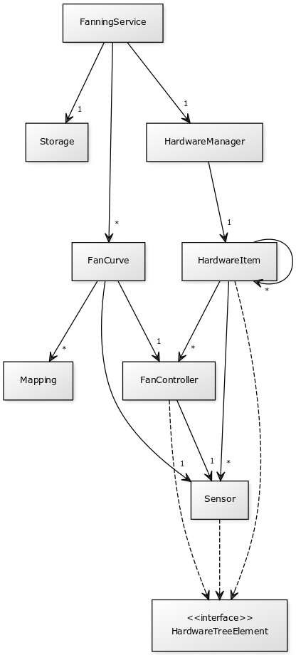

# Architecture

<!-- [FanningService]-1>[HardwareManager], [HardwareManager]-1>[HardwareItem], [HardwareItem]-*>[HardwareItem], [HardwareItem]-*>[Sensor], [HardwareItem]-*>[FanController], [FanController]-1>[Sensor], [FanningService]-*>[FanCurve], [FanCurve]-1>[Sensor], [FanCurve]-1>[FanController], [HardwareItem]-.->[<<interface>>;HardwareTreeElement], [Sensor]-.->[<<interface>>;HardwareTreeElement], [FanController]-.->[<<interface>>;HardwareTreeElement] -->

## Structure

There are four main parts in the software.

- Hardware interface handles communication with a hardware sensor library.
- Mock hardware is a mock implementation for the hardware interface.
- Core package handles the data model of the software, permanent storage (soon) and controlling the hardware (soon).
- GUI presents the functions of the core package to the user.

Fanning uses the JavaFX property pattern extensively. Properties are observable boxes around variables, that can be bound to follow the values of each other automatically. Constantly changing variables, such as sensor values and GUI text field texts can then be bound to each other.

## Hardware interface

The hardware interface consists of four interface classes.

- HardwareManager
- HardwareItem
- Sensor
- FanController

The hardware is organized into a tree structure, where the hardware items can contain their own subhardware, sensors and fan controllers. Every fan controller contains a reference to some sensor which displays its controllable value (usually a fan speed percentage). The hardware manager is an access point to this tree, and also provides useful methods for getting all sensors and fan controllers. This hardware tree model is heavily inspired by the OpenHardwareMonitor API.

The hardware interface is meant to be implemented by various sensor library adapters. The user can then use any platform specific sensor library and attach it to this software.

## Mock hardware

Since testing the software is hard with a platform specific real sensor library, Fanning includes a mock hardware for testing and development purposes. It generates random sensor values and its fans respond to being controlled.

## Core

The FanningService class is the entry point to all the core functionality. It currently only contains a list of all the fan curves and the hardware manager.

## GUI

The GUI consists of the main class Fanning, main content pane FanningPane, a set of different fan curve panes and some utility GUI components.

The main content pane has tree views of all the sensors and fan controllers in the system. It selects the appropriate fan curve pane based on which sensors and fan controllers are selected on the tree views.

- If a fan controller is selected
  - and the fan controller is controlled by some fan curve
    - show the fan curve editing pane (FanCurvePane)
  - and the fan controller is not controlled
    - and a sensor is selected
      - show a pane for creating new fan curve (CreateFanCurvePane)
    - and a sensor is not selected
      - tell the user to select a sensor (NotControlledPane)
- If a fan controller is not selected
  - tell the user to select a fan controller (NotSelectedPane)

The FanningService is injected directly into every GUI component class that needs it. The fan curve editing pane also has an associated fan curve and independently handles displaying and editing its data.